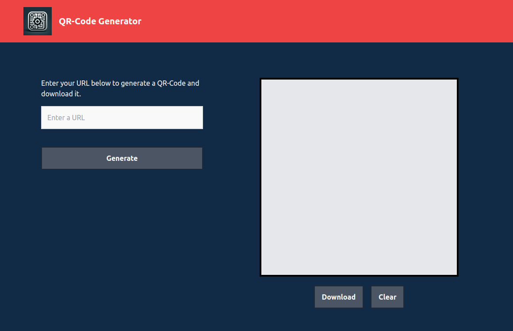

## Simple QR-Code Generator

:fast_forward: **[Live demo](https://qr-code-1generator.netlify.app/)**

### Overview
Developed using React, this code creates a QR code generator. Users can input a URL and upon submission, a QR code is dynamically generated and displayed. Users can then download the QR code image or clear the input and the generated code.

### Tools
- React (JavaScript)
- Vite
- TailwindCSS
- QRCode library
- Git
- GitHub
- VSCode

----

### Screenshot
